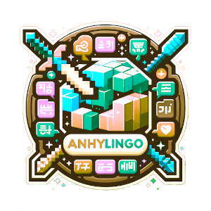

    

### AnhyLingo Plugin Documentation

**AnhyLingo** is a Minecraft server plugin that enables the creation of a multilingual interface. It allows players to receive system messages, messages from other plugins, and see item names and descriptions in their chosen language. Tested on servers with `Spigot`, `Paper`, and `Purpur` kernels version `1.20.2`. Requires the latest version of the `ProtocolLib` plugin to function.

### Main Features of the Plugin

1. **Multilingual Support**
    - Players can choose their preferred languages using a command.
    - Automatically uses the client's Minecraft language settings if the player hasn't set their languages.
    - Displays text in the game chat and action bar in multiple languages.
    - Automatically translates custom items during interactions.

2. **Item Management**
    - Ability to create multilingual items (for players with administrative rights).

3. **NBT Tag Management**
    - View available NBT tags for items.
    - Set, modify, and delete NBT tags for items.

4. **File Management**
    - Upload language files to the plugin's folder.
    - Upload any files to allowed folders.
    - Delete files from allowed folders. Unique methods for event logging.
