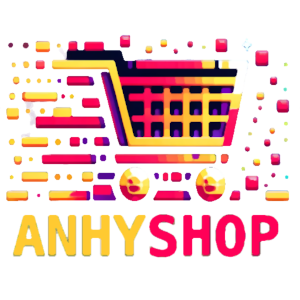

    

### AnhyShop Plugin Documentation

**AnhyShop** is a unique plugin for creating traders and organizing trade on Minecraft servers, based on the villager trading inventory. It has been tested on Spigot, Paper, and Purpur server cores for version 1.20.4.

#### Essential Requirements for AnhyShop

To function, AnhyShop requires the **AnhyLibAPI** library version 1.5.2 or higher. This library is an integral part of the plugin, ensuring its stability and efficiency. Without **AnhyLibAPI**, AnhyShop will not work.

Additionally, AnhyShop is compatible with **AnhyLingo** version 0.3.3 or higher, though this plugin is not mandatory. Installing AnhyLingo extends AnhyShop's multilingual capabilities by adding support for multilingual items in trades. The absence of AnhyLingo does not affect AnhyShop's core functionality.

#### Key Features of the Plugin

- **Simplicity and Convenience:** No complex configurations are required; all data is automatically saved in the built-in SQLite database (`shops.db` file in the plugin folder).
- **Data Security:** Information about traders is encrypted, preventing it from being viewed or edited directly in the database file.
- **Flexible Usage:** The ability to open trades via console commands or players with appropriate permissions allows server administrators to integrate shops with other plugins, scripts, command blocks, and more.

AnhyShop is the ideal choice for Minecraft servers that seek simplicity in trade management without sacrificing functionality.